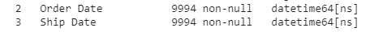
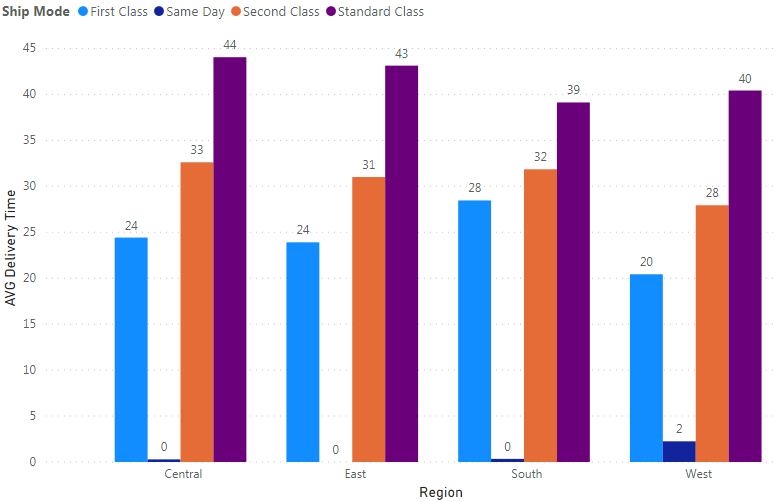
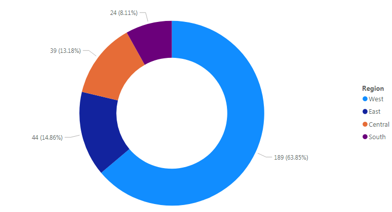
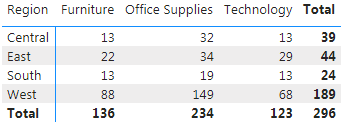
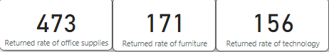
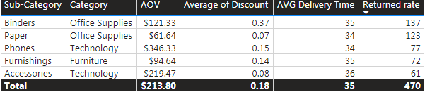

# Supply-Chain-Sales-Analysis


## I. Introduction
Understanding supply chain operations and sales performance is crucial for businesses to optimize operations and drive revenue growth. Analyzing key metrics such as revenue, profitability, delivery times, return rates, and customer behavior enables businesses to make accurate strategic decisions. In this challenge, I will work with real-world data on orders, customers, products, and sales regions to uncover insights and create interactive reports using Power BI.

## II. Data source
### 1. Data overview
- The dataset provides detailed information on supply chain operations and sales performance for a retail company. It is designed to help business analyze order processing, logistic, delivery performance, return rates and customer management, allowing them to optimize supply chain efficiency and improve strategic planning.
- The dataset is suitable for analyzing inventory flow, transportation efficiency, product demand and revenue distribution over regions, proving business leaders a comprehensive view of supply chain operations.
  
[LINK](https://docs.google.com/spreadsheets/d/1jNIom306z4gm8cLu3iBu1ocqfrczYac9/edit?gid=1597858120#gid=1597858120)

### 2. Data description
This dataset consists of 29 columns, each representing a key aspect supply chain operations, specifically as follows:
- Retail Order ID: Unique retail order identifier
- Order ID: General order identifier
- Order ID: General order identifier
- Ship Date: Actual shipping date
- Ship Mode: Shipping method (Standard, Express, Same-Day)
- Customer ID: Unique customer identifier
- Customer Name: Full name of the customer
- Segment: Customer segment (Consumer, Corporate, Home Office)
- Postal Code: Zip/Postal code
- Country: Country of the customer
- City: City where the order was placed
- State: State/Province of the customer
- Region: Sales region
- Latitude: Geographical latitude
- Longitude: Geographical longitude
- Retail Sales People: Retail sales representatives
- Product ID: Unique product identifier
- Category: Product category
- Sub-Category: Product sub-category
- Product Name: Full product name
- Returned: Return status (Yes/No)
- Sales: Revenue from the order
- Quantity: Number of units sold
- Discount: Discount applied to the order
- Profit: Profit from the order
- Cost: Original cost of the order
- Unit CP: Cost price per unit
- Unit SP: Sales price per unit
- Days: Actual delivery days

## III. Methodology
### 1. Data preparation & cleaning
I will do this step on Google Colabs. Firstly, I will check the information of the dataset and here is the result:
||
|:--:|
|**Fig.1. The information of the dataset**|

**There is no missing values in the dataset**. But I need to convert "," into "." in numeric data by the following code:
```python
for col in df.select_dtypes(include='object').columns:
  df[col] = df[col].str.replace(",", ".", regex=True)
```
Next, convert the datatype of the columns that can be converted to numeric by doing the following:
```python
df = df.apply(pd.to_numeric, errors="ignore")
```
And here is the result after the changes:
||
|:--:|
|**Fig.2. The information of the dataset after changing data types**|

Finally, I will change the data type of the Order Date and Ship Date columns to datetime.
```python
df['Order Date'] = pd.to_datetime(df['Order Date'], format ="mixed")
df['Ship Date'] = pd.to_datetime(df['Ship Date'], format = "mixed")
```
||
|:--:|
|**Fig.3. Data types of Order Date and Ship Date**|

So we have a complete dataset table, ready for visualization on Power Bi.

## IV. Visualization
Here is my dashboard, I will delve into details in the next part.
|||
|:--:|:--:|

To analyze and provide insights, as well as actionable insights, we need to answer the following questions:

*1. What is the average delivery time, and which region has the slowest deliveries ?*
   
Based on the dashboard, the average delivery time for the business is around 35 days. And the West region has the lowest average delivery time, around 33 days. Meanwhile, the Central region has the longest average delivery time, around 37 days.
||
|:--:|
|**Fig.4. AVG Delivery Time by Region**|

To explain the difference, let's look at the following two figures, which are a matrix showing the distribution of shipping modes in the regions and a column chart showing the average delivery time of each shipping mode.
|||
|:--:|:--:|
|**Fig.5. Matrix showing the distribution of shipping modes in the regions**|**Fig.6. Column chart showing the AVG delivery time of each shipping mode**|

We can see in the matrix that the West region has the highest number of orders shipped using the two express delivery methods (First Class and Same Day) among the four regions, with **256** and **89** orders shipped, respectively. In Fig.7, we can also see that the average delivery time of shipping modes in the Western region is shorter than that of the same shipping modes in other regions. This explains why the average delivery time in this region tends to be shorter than in other regions.
||
|:--:|
|**Fig.7. AVG Delivery Time by Regions and Shipping Mode**|

*2. How does delivery time impact profitability ?*

||
|:--:|
|**Fig.8. Profit by regions**|

From the chart in Figure 8, we can see that the West region with the lowest average delivery time is the region with the highest profit. This may be because customers perceive this region as having faster delivery times than other regions, so they place more orders, **1611 orders** in total (Matrix in Figure 5 shows that), thereby helping to increase revenue, as well as profit in the region.

*3. Which region has the highest return rate ?*

||
|:--:|
|**Fig.9. Total returned orders by regions**|

Despite being known as the region with the shortest average delivery time, the West region also had the highest number of returned orders, with **189 orders**, accounting for **63.85%** of the business's total returned orders (Fig.11). To examine why the West region has such a high return rate, let's look at the image below (Fig.12)
||
|:--:|
|**Fig.10. Total returned orders by categories and regions**|

From the above matrix, we can see that in the Western region, the highest number of returned orders belongs to Office Supplies, with **149 returned orders**, this is also the category with the highest return rate of the business, we will discuss the issue in the next question.

*4. Which product has the highest return rate, and what are the key causes ?*

||
|:--:|
|**Fig.11. Returned rates by categories**|

Figure 11 shows the number of times the three product categories (Office Supplies, Furniture, Technology) were returned in orders. Of these, the Office Supplies category led with **473 returns**. There are a few reasons why this could happen, it could be the sub-category of the category or the type of customer ordering these Office Supplies items. Let’s take a look at some visuals to try and figure out why.

|||
|:--:|:--:|
|**Fig.12. Table showing top 5 most returned sub-categories**|**Fig.13. Matrix showing returned rates by customer segment and categories**|


