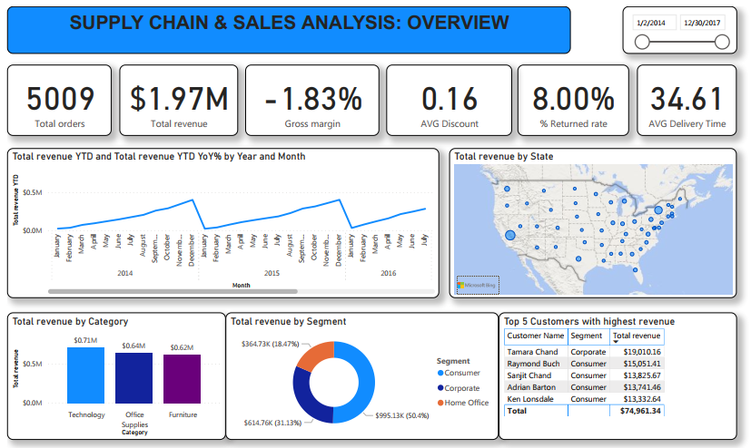

# Supply-Chain-Sales-Analysis


## I. Introduction
Understanding supply chain operations and sales performance is crucial for businesses to optimize operations and drive revenue growth. Analyzing key metrics such as revenue, profitability, delivery times, return rates, and customer behavior enables businesses to make accurate strategic decisions. In this challenge, I will work with real-world data on orders, customers, products, and sales regions to uncover insights and create interactive reports using Power BI.

## II. Data source
### 1. Data overview
- The dataset provides detailed information on supply chain operations and sales performance for a retail company. It is designed to help business analyze order processing, logistic, delivery performance, return rates and customer management, allowing them to optimize supply chain efficiency and improve strategic planning.
- The dataset is suitable for analyzing inventory flow, transportation efficiency, product demand and revenue distribution over regions, proving business leaders a comprehensive view of supply chain operations.
  
[LINK](https://docs.google.com/spreadsheets/d/1jNIom306z4gm8cLu3iBu1ocqfrczYac9/edit?gid=1597858120#gid=1597858120)

### 2. Data description
This dataset consists of 29 columns, each representing a key aspect supply chain operations, specifically as follows:
- Retail Order ID: Unique retail order identifier
- Order ID: General order identifier
- Order ID: General order identifier
- Ship Date: Actual shipping date
- Ship Mode: Shipping method (Standard, Express, Same-Day)
- Customer ID: Unique customer identifier
- Customer Name: Full name of the customer
- Segment: Customer segment (Consumer, Corporate, Home Office)
- Postal Code: Zip/Postal code
- Country: Country of the customer
- City: City where the order was placed
- State: State/Province of the customer
- Region: Sales region
- Latitude: Geographical latitude
- Longitude: Geographical longitude
- Retail Sales People: Retail sales representatives
- Product ID: Unique product identifier
- Category: Product category
- Sub-Category: Product sub-category
- Product Name: Full product name
- Returned: Return status (Yes/No)
- Sales: Revenue from the order
- Quantity: Number of units sold
- Discount: Discount applied to the order
- Profit: Profit from the order
- Cost: Original cost of the order
- Unit CP: Cost price per unit
- Unit SP: Sales price per unit
- Days: Actual delivery days

## III. Methodology
### 1. Data preparation & cleaning
I will do this step on Google Colabs. Firstly, I will check the information of the dataset and here is the result:
||
|:--:|
|**Fig.1. The information of the dataset**|

**There is no missing values in the dataset**. But I need to convert "," into "." in numeric data by the following code:
```python
for col in df.select_dtypes(include='object').columns:
  df[col] = df[col].str.replace(",", ".", regex=True)
```
Next, convert the datatype of the columns that can be converted to numeric by doing the following:
```python
df = df.apply(pd.to_numeric, errors="ignore")
```
And here is the result after the changes:
||
|:--:|
|**Fig.2. The information of the dataset after changing data types**|

Finally, I will change the data type of the Order Date and Ship Date columns to datetime.
```python
df['Order Date'] = pd.to_datetime(df['Order Date'], format ="mixed")
df['Ship Date'] = pd.to_datetime(df['Ship Date'], format = "mixed")
```
||
|:--:|
|**Fig.3. Data types of Order Date and Ship Date**|

So we have a complete dataset table, ready for visualization on Power Bi.

### 2. Visualization & Give insights
Here is my dashboard, I will delve into details in the next part.
|||
|:--:|:--:|
|||

**Revenue & Supply Chain Performance**
- Revenue increased, but the gross margin was negative. Total revenue for the year 2017 reached **$631.9k**, up **19.62%** year over year. However, gross margin was negative, **-1.83%**. This could be due to an unreasonable pricing policing, where costs are higher than selling prices, and excessive discounts could also lead to this situation.
- Technology products lead in revenue, with **$0.71m** followed by products in the office supplies and furniture categories, with **$0.64m** and **$0.62m** respectively. However, office supplies have the highest profit, due to much lower costs.
- The consumer segment brings in the largest revenue (**$995.1k**), followed by corporate (**$614.8k**) and finally home office (**$364.7k**). It can be seen that the consumer segment is still the main customer segment that needs to be focused on, while it is also necessary to increase attention to the corporate customer segment and improve the experience of the home office segment.
- Average delivery time varies between regions. The fastest region is the West, at **32.59** days, and the slowest is the Central, at 36.98 days. This difference can affect the profits these regions bring in, with the fastest region being the West, which brought in a profit of **$15k**. Meanwhile, the Central region made a huge loss of **$38k**.
- Inappropriate discount policy causes heavy losses in furniture products. Furniture accounted for the largest portion of total costs, at **$723.55k**. However, due to inappropriate discounting policies, this resulted in a loss of profit of up to **$105k**.

**Returned Rate & Delivert Analysis**
- Technology items have the highest return rate, **8.45%**, followed by furniture with **8.06%** and finally office supplies with **7.85%**. Meanwhile, Same Day shipping mode has the highest return rate at **11.79%**, second is First Class with **9.88%**. With Same Day shipping mode, Technology items have a very high return rate, up to **14.29%**, followed by First Class with **10.63%**. Although the number of transactions of technology items using either shipping mode is not too much, but with such a high return rate, this is also a high risk cause. In addition, the remaining shipping modes such as Standard and Second Class also have quite high return rates.
- For the customer segment, the Consumer group has the highest technology product return rate at **9.15%**, possibly due to high expectations, easy to change their mind and somewhat emotional shopping.
- In general, technology products are high-value items, prone to errors, and customers are often more careful about returns. Therefore, choosing urgent delivery methods can easily lead to errors leading to customer dissatisfaction.

**Revenue Forecast**

Based on the growth of revenue in previous year, revenue forecast for next quarter (2018 Q1) is around **$165,675**, high around **$212,340** and low around **$119,010**.

So, what should we do after we know all these valuable insights ? Let's discuss this question in the next section.

## IV. Actionable insights
I will give some next moves based on the insights analyzed above. Specifically as follows:
**Revenue & Supply Chain Efficiency**
- Negative gross margin (-1.83%) despite increasing revenue => Review pricing and promotion policies.
- Office Supplies is highly profitable => Increase marketing focus, prioritize sales.
- Consumer brings in the main revenue => Maintain care, expand into Corporate & Home Office as well.
- Central region has big losses & slow delivery => Optimize logistics, limit deep discounts here.
- Furniture loses due to wrong discounts => Adjust discount program.

**Return and Delivery Analysis**
- Technology products need to be more carefully controlled for quality before delivery, due to high return rates across all delivery methods. Take steps such as: Check for technical errors (hardware/software) before packaging; Enhance safe packaging for perishable products; Provide clear instructions for use, reducing misunderstandings about features.
- Limit Same Day use for high-value technology orders, but do not completely remove it – use it selectively, for example: only with loyal customers and good purchase history.

**First quarter/2018 Forecast**

Estimated revenue around **$165.7k** (highest possible around **$212k**) => Prepare flexible plans, prioritize high-profit product groups (Office Supplies), increase marketing at the beginning of the quarter.


